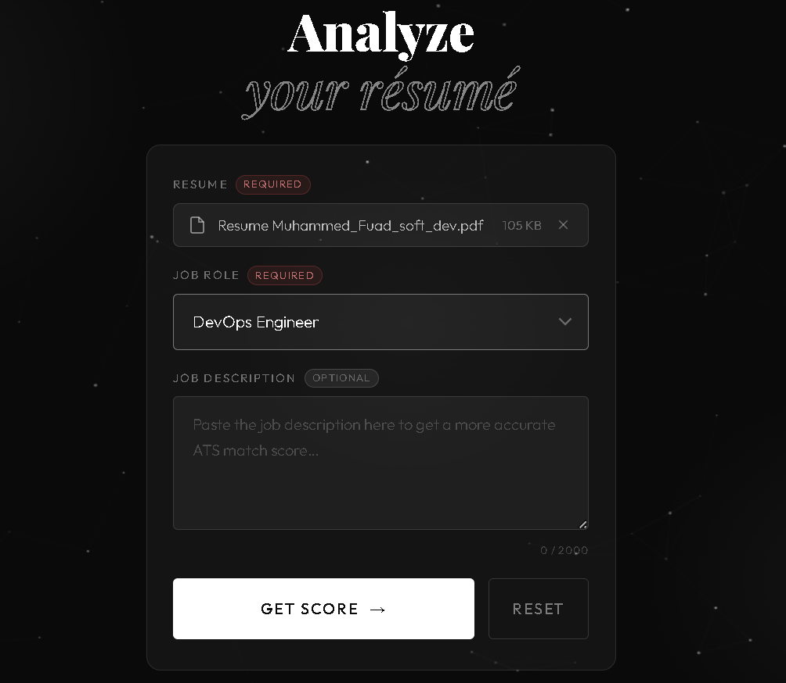
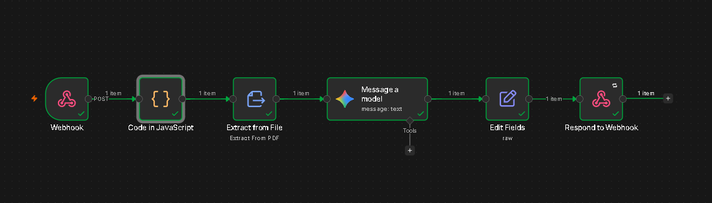
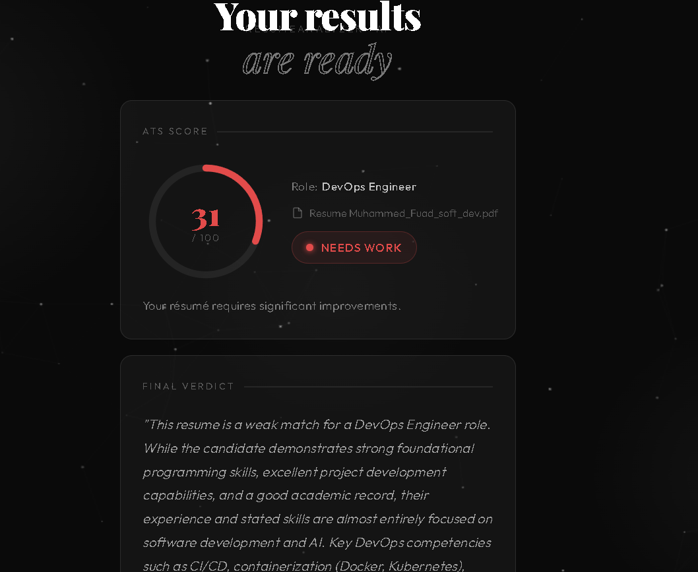

<div align="center">

# 🧠 ResumeAnalyzer · AI

**An intelligent, ATS-aware resume analysis platform powered by n8n automation and a custom AI pipeline — built with Next.js and Firebase.**

[](https://nextjs.org/)
[](https://firebase.google.com/)
[](https://n8n.io/)
[](LICENSE)

</div>

---

## 📌 Overview

**ResumeAnalyzer · AI** is a full-stack web application that lets job seekers upload their résumé, select a target job role, and receive an AI-generated ATS (Applicant Tracking System) score along with detailed, actionable feedback — all within seconds.

The app sends the resume to an **n8n automation workflow** which processes it through an AI model, then returns a structured analysis covering score breakdowns, missing keywords, strengths, improvement recommendations, and a final verdict.

> Built with a dark, editorial aesthetic using Playfair Display × Outfit typography and an interactive particle canvas background.

---

## ✨ Features

| Feature | Description |
|---|---|
| 📄 **Resume Upload** | Drag-and-drop or tap-to-upload. Supports PDF, DOC, DOCX (max 5 MB) |
| 🎯 **80+ Job Roles** | Covers Tech, Design, Product, Finance, HR, Healthcare, and more |
| 📝 **Job Description Input** | Paste a JD for a more accurate ATS keyword match score |
| 🔄 **Live Analysis Animation** | 4-step animated overlay while the AI processes the resume |
| 📊 **ATS Score Ring** | Animated circular score (0–100) color-coded by rating |
| ✅ **Strengths** | What the resume already does well |
| 🔧 **Improvements** | Numbered, actionable recommendations |
| 🏷️ **Missing Keywords** | Interactive keyword pills to add to the resume |
| ⚠️ **Resume Issues** | Detected formatting or content problems |
| 🏁 **Final Verdict** | AI-generated summary of the candidate's overall fit |
| 🔐 **Firebase Auth** | Secure login and sign-up with Google Firebase Authentication |

---

## 🖥️ Screenshots


| Analyzer Page | Analyzing Overlay | Result Page |
|---|---|---|
|  |  |  |

---

## 🏗️ Architecture

```
┌─────────────────────────────────┐
│         Next.js Frontend        │
│                                 │
│  /login        Firebase Auth    │
│  /signup       Firebase Auth    │
│  /resume-analyzer  ──────────── │─────────────────────────┐
│  /result                        │                         │
└─────────────────────────────────┘                         │
                                                            ▼
                                              ┌─────────────────────────┐
                                              │     n8n Cloud Workflow   │
                                              │                          │
                                              │  Webhook Trigger         │
                                              │       ↓                  │
                                              │  Extract PDF Text        │
                                              │       ↓                  │
                                              │  AI Model (LLM)          │
                                              │       ↓                  │
                                              │  Respond to Webhook      │
                                              └─────────────────────────┘
```

### Data Flow

1. User uploads resume → frontend converts it to **base64**
2. On "Get Score" click → **webhook fires immediately** (parallel to animation)
3. n8n receives `{ fileName, fileType, fileBase64, jobRole, jobDescription }`
4. n8n extracts text from the PDF, runs it through an AI model, returns structured JSON
5. Frontend parses the response → saves to **sessionStorage** → navigates to `/result`
6. Result page reads sessionStorage and renders all analysis sections

---

## 🧩 Tech Stack

### Frontend
- **[Next.js 15](https://nextjs.org/)** — App Router, `"use client"` components
- **React 18** — Hooks: `useState`, `useEffect`, `useRef`, `useCallback`
- **Vanilla CSS-in-JS** — Scoped `<style>` tags, no CSS modules or Tailwind
- **Google Fonts** — Playfair Display (display) + Outfit (body)
- **Canvas API** — Animated particle network background

### Backend / Automation
- **[n8n](https://n8n.io/)** — No-code/low-code automation workflow
  - Webhook Trigger node
  - PDF text extraction
  - AI/LLM node (e.g. OpenAI, Anthropic, Gemini)
  - Respond to Webhook node

### Auth
- **[Firebase Authentication](https://firebase.google.com/docs/auth)** — Email/password or Google sign-in

---

## 📁 Project Structure

```
resume_shortlisting/
├── app/
│   ├── login/
│   │   └── page.jsx              # Login page
│   ├── signup/
│   │   └── page.jsx              # Sign-up page
│   ├── resume-analyzer/
│   │   └── page.jsx              # Main analyzer page (upload + submit)
│   ├── result/
│   │   └── page.jsx              # Results page (ATS score + feedback)
│   └── layout.jsx                # Root layout
├── FirebaseConfig.js             # Firebase app initialization
├── public/
│   └── screenshots/              # Add your screenshots here
├── .env.local                    # Environment variables (see below)
├── next.config.js
└── package.json
```

---

## ⚙️ Setup & Installation

### Prerequisites

- Node.js 18+
- npm or yarn
- A Firebase project (free tier works)
- An n8n instance ([n8n Cloud](https://n8n.io/) or self-hosted)

### 1. Clone the Repository

```bash
git clone https://github.com/your-username/resume-analyzer-ai.git
cd resume-analyzer-ai
```

### 2. Install Dependencies

```bash
npm install
```

### 3. Configure Environment Variables

Create a `.env.local` file in the project root:

```env
# Firebase
NEXT_PUBLIC_FIREBASE_API_KEY=your_api_key
NEXT_PUBLIC_FIREBASE_AUTH_DOMAIN=your_project.firebaseapp.com
NEXT_PUBLIC_FIREBASE_PROJECT_ID=your_project_id
NEXT_PUBLIC_FIREBASE_STORAGE_BUCKET=your_project.appspot.com
NEXT_PUBLIC_FIREBASE_MESSAGING_SENDER_ID=your_sender_id
NEXT_PUBLIC_FIREBASE_APP_ID=your_app_id
```

### 4. Configure the Webhook URL

In `app/resume-analyzer/page.jsx`, update the webhook URL to your n8n endpoint:

```js
const WEBHOOK_URL = "https://your-n8n-instance.app.n8n.cloud/webhook/your-path";
```

### 5. Run the Development Server

```bash
npm run dev
```

Open [http://localhost:3000](http://localhost:3000) in your browser.

---

## 🔧 n8n Workflow Setup

### Webhook Trigger Node
- **HTTP Method:** POST
- **Path:** `/resume-analyzer` (or your chosen path)
- **Response Mode:** Using "Respond to Webhook" node

### Incoming Payload (from frontend)

```json
{
  "fileName": "john_doe_resume.pdf",
  "fileType": "application/pdf",
  "fileSize": 204800,
  "fileBase64": "JVBERi0xLjQK...",
  "jobRole": "Software Engineer",
  "jobDescription": "We are looking for..."
}
```

### Decode the Base64 PDF (Code Node)

```javascript
const buffer = Buffer.from($json.fileBase64, 'base64');
return [{ json: $json, binary: { data: await this.helpers.prepareBinaryData(buffer, $json.fileName, $json.fileType) } }];
```

### Expected Response Shape (from AI node → Respond to Webhook)

```json
{
  "ats_score": {
    "overall_score": 87,
    "rating": "Excellent Match"
  },
  "strengths": [
    "Strong project portfolio showcasing full-stack skills.",
    "Well-structured, keyword-rich resume."
  ],
  "missing_keywords": ["Docker", "CI/CD", "AWS", "Agile"],
  "improvement_recommendations": [
    "Add a Testing section listing frameworks used.",
    "Quantify achievements with measurable impact."
  ],
  "resume_issues": ["Minor: No cloud platform experience mentioned."],
  "keyword_coverage": {
    "matched_keywords": ["Python", "React", "Node.js"],
    "missing_keywords": ["Docker", "Kubernetes"],
    "coverage_percentage": 82
  },
  "final_verdict": {
    "status": "Excellent Match",
    "summary": "A strong entry-level candidate with exceptional project experience."
  }
}
```

### Respond to Webhook Node Settings
- **Respond With:** JSON
- **Response Body:** `{{ $json }}`
- **Content-Type:** `application/json`

---

## 🎨 Design System

| Element | Value |
|---|---|
| Background | `#0a0a0a` |
| Display Font | Playfair Display (900, 700, 400, italic) |
| Body Font | Outfit (200–500) |
| Score: Excellent | `#4ae27a` (green) |
| Score: Good | `#e2c94a` (amber) |
| Score: Average | `#e2914a` (orange) |
| Score: Poor | `#e24b4a` (red) |
| Card Background | `rgba(255,255,255,0.04)` |
| Card Border | `rgba(255,255,255,0.1)` |

---

## 🔐 Firebase Auth Setup

1. Go to [Firebase Console](https://console.firebase.google.com/)
2. Create a new project
3. Enable **Authentication** → **Email/Password** (and/or Google)
4. Copy your config from **Project Settings → Your Apps → Web App**
5. Paste into `.env.local` as shown above

The `FirebaseConfig.js` file initializes the Firebase app:

```js
import { initializeApp } from "firebase/app";

const firebaseConfig = {
  apiKey:            process.env.NEXT_PUBLIC_FIREBASE_API_KEY,
  authDomain:        process.env.NEXT_PUBLIC_FIREBASE_AUTH_DOMAIN,
  projectId:         process.env.NEXT_PUBLIC_FIREBASE_PROJECT_ID,
  storageBucket:     process.env.NEXT_PUBLIC_FIREBASE_STORAGE_BUCKET,
  messagingSenderId: process.env.NEXT_PUBLIC_FIREBASE_MESSAGING_SENDER_ID,
  appId:             process.env.NEXT_PUBLIC_FIREBASE_APP_ID,
};

export const app = initializeApp(firebaseConfig);
```

---

## 🚀 Deployment

### Vercel (Recommended)

```bash
npm install -g vercel
vercel
```

Add all `.env.local` variables to your Vercel project's **Environment Variables** settings.

### Other Platforms
The app is a standard Next.js 15 project and can be deployed to Netlify, Railway, Render, or any platform that supports Node.js.

---

## 🛣️ Roadmap

- [ ] PDF text preview before submission
- [ ] Side-by-side keyword diff view
- [ ] Resume rewrite suggestions powered by AI
- [ ] History of past analyses per user (Firestore)
- [ ] Export results as PDF report
- [ ] Multi-language support
- [ ] Admin dashboard for usage analytics

---

## 🤝 Contributing

Contributions are welcome! Please:

1. Fork the repository
2. Create a feature branch: `git checkout -b feature/your-feature`
3. Commit your changes: `git commit -m 'Add some feature'`
4. Push to the branch: `git push origin feature/your-feature`
5. Open a Pull Request

---

## 📄 License

This project is licensed under the **MIT License** — see the [LICENSE](LICENSE) file for details.

---

## 👤 Author

**Muhammed Fuad**
- GitHub: https://github.com/Muhammed-Fuad/
- LinkedIn: https://www.linkedin.com/in/muhammed-fuaad/

---

<div align="center">

Made with ❤️ and a lot of AI

⭐ Star this repo if it helped you land your dream job!

</div>
